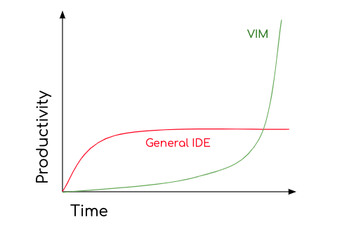
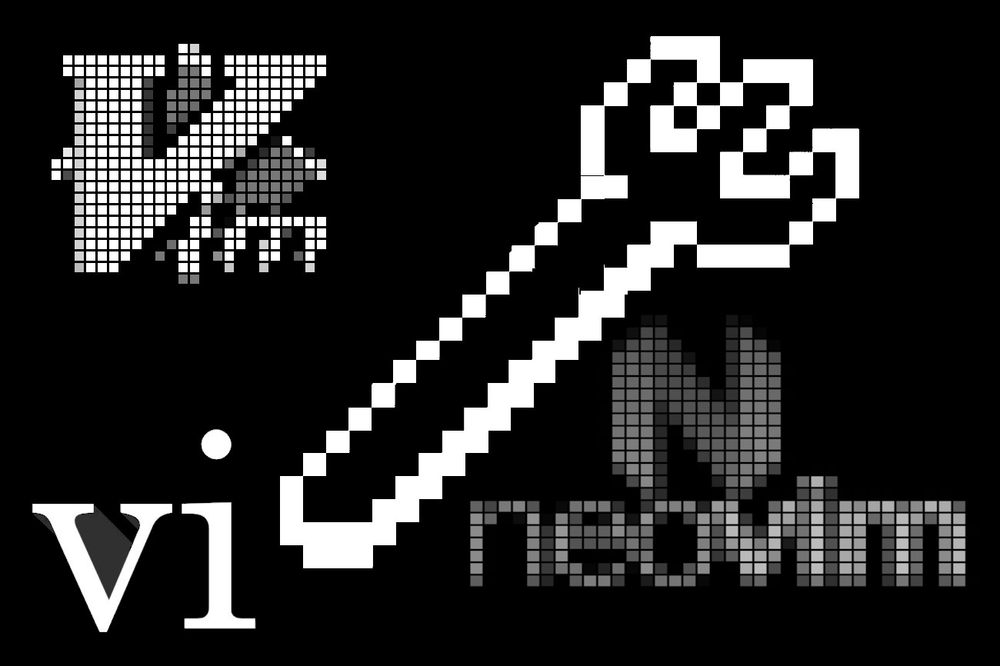

<!-- Use reveal-md to show this presentation -->

### VIM | Ram Matityahu
# LoVIM . IT!

Note: In this lecture we'll take a technical dive into VIM and learn how to work with it

---

# Work from the command line
* VIM - IDE
* TMUX - Window Manager
* Bonus - Other terminal tools 

Note: Vim - not an editor Other tools like lazygit, if we have time

---

# Notes
* github.com/ramat84/vim (vim.md)
* github.com/ramat84/config
* Custom configuration, Stuff may vary
* Colors might be off for you 

Note: Presentation available, Created with VIM Configuration for nvim, can be used in VIM Custom shortcuts Fix colors with :checkhealth in nvim

---

# Adventages
* Everything is very quick
* Works the same on any OS
* Can be accessed remotely with ease
* Actions are repeatable

Note: Loads Quickly Runs Quickly Don't wait for anything Can do repeatable stuff multiple times fast

---

# Install
* Mac: brew install macvim --override-system-vim
* Linux: apt/pacman/yum [install] gvim
* Windows: Download and install gvim.exe
* Android: In Termux app, "apt install vim"

Note: In windows can be installed from build in linux subsystem For android use hackers keyboard

---

# TMUX
* Sessions & attach
* Tabs
* Split Windows

Note: tmux ls tmux attach -t NAME Copy & Paste, No example

---

# Windows 
* Tabs
* Buffers
* Windows

---

# Basics
* : - Go to VIM command mode
* q - quit
* e - open file
* w - write  (save/save as)

Note: Ask me how to quit VIM ESC has another function Open existing/new file

---

# Out of the box
## How most of us know VIM
* Pretty bare boned and ugly
* No UI elements (numbers, file manager, tabs, etc...)
* No Auto complete
* No Git information

---

# Chalanges
## Learning Curve

---

# Modal Editor
## Edit before insert
* Normal - Manipulate code, Navigate Files
* Insert - Insert code
* Visual - Work visually with code

---

# Normal Mode
## Motions
### Move the cursor

* {k}, {j} {-}, {+} {h} {l} - Up/Down Left/Right
* {G}, {gg}, {^}, {$} - Start/End of Document/Line
* {f/F}, {t/T} - Find, Till
* {w} {W} {b} {B} {e} {E} - Word, Back, End
* {%}, {✱} - Same Word
* {⦃}, {⦄} - Paragraphs
* {'}, {"} - Parenthesis

---

# Normal Mode
## Operators
* {c} - Change
* {d} - Delete 
* {y} - Yank (copy)
* {gU} {gu} - Go Uppercase/Lowercase
* {＜} {＞} - Tab left/right

---

# Normal Mode
## Objects
* {a} - a / {i} - inner
* {w} {W} - word/WORD
* {p} - Paragraph
* {b} - Bracket
 
---

# Normal Mode
## Steps
### Use one of two formats

* [Count] [Operator] [Motions/Objects]
* 5       y          +
* 3       d          w

* [Operator] [Count] [Motions/Objects]
* y       5          +
* d       3          w

---

# Sessions

---

# Macros
* Record a macro
* Repeat a macro

---

# Does Well
## Out of the box
* Runs quickly
* Runs everywhere
* Make work more efficient

---

# Versions
* VI - Really Retro (1976)
* VIM - VI Explosion (1991)
* NeoVIM - Vim For Hipsters (2014)

---

# VIM Plugins
* Modular and installed by demend
* Extend functionality
* Efficiency can be monitored
* "Marketplace"
* Installation
* Removal

---

# VIM Plugins
# NerdTree
# FZF
# CoC
Note: NerdTree: File Manager, Bookmarks, File Manipulation Coc: Syntax Autocomplete, Jump to definition,History, Grep

---

# GIT
* Mark Changes
* Blame
* LazyGit
* DiffConflicts 

---

# More Resources
* Pimp My Terminal
* Oh My Bash/ZSH
* lsd
* MitzaSQL

Note: bm Bookmarks

---

# Thanks

