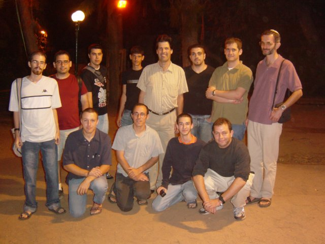

<!-- Use reveal-md to show this presentation -->

# LoVim . IT!
### Vim | Ram Matityahu
#### 937.1337


Note: In this lecture we'll take a technical dive into Vim and learn how to work with it<BR>

---

# Bare with me
* My last lecture: JLC in 2005
* I used kate editor
* I Switched to Terminal half a year ago


---

# 🖎 Notes
## All sources are available here
* github.com/ramat84/Vim (Vim.md)
* github.com/ramat84/config

Note: Presentation available, Created with Vim<br>Configuration for NVim, can be used in Vim<br>Custom shortcuts

---

# Versions
* 👴 VI - Really Retro (1976)
* 🤯 Vim - VI Explosion (1991)
* 🧔 NeoVim - Vim For Hipsters (2014)

Note: A bit of history<br>VI - original, simple, not extendable<br>Vim - Extendable with plugins, Much more advanced<br>NVim - improved Vim, does everything Vim does, spitted to make Vim development more mainstream and not block development.

---

# 📦 Out of the box
## How most of us know Vim
* 🦴 Pretty bare boned,  No UI elements
* … No Auto complete
* 🛠 No Git information

```
vim -u NONE
```

Note: vim -U NONE examples/files/jquery.js

---

# Learning Curve


---

# ✔ Adventages
* ⚡ Everything is very quick
* 💻 Works the same on any OS
* 🚪 Can be accessed remotely with ease
* ➿ Actions are repeatable
* 🕔 Make work more efficient
* ⚙ Vim mode exists in most modern IDEs

Note: Loads Quickly<br>Runs Quickly<br>Don't wait for anything<br>Can do repeatable stuff multiple times fast

---

# How to learn Vim
* Tutorial: Vimtutor 
* Game: https://Vim-adventures.com/
* Youtube: Learning Vim in a Week 
* Google: Vim for [MY LANGUAGE]
* Search for Cheat sheets or Vim wallpapers

Notes: You can find links to the cheatsheets in the presentation

<!-- 
Cheat sheets:
    My Cheat sheets:
    https://github.com/ramat84/vim/tree/master/cheatsheets

    Others:
    https://cdn.shopify.com/s/files/1/0165/4168/files/preview.png 
-->

---

# 🤔 Know Before beginning
* 🍺 It's free (as a beer)
* 🤖 It's different
* ⌨ It's a keyboard thing

Note: Vim is nothing like you ever used before

---

# 🖵 TMUX
* Sessions & attach
* Tabs
* Split Windows

Note: tmux ls<br>tmux attach -t NAME<br>Copy & Paste, No example

---

# Installtion
* 🍎 Mac: brew install macVim --override-system-Vim
* 🐧 Linux: apt install gVim
* 🪟 Windows: gVim.exe
* 🤖 Android: Use Termux Linux terminal

```
On mac use iTerm2!
🎨 And setup the colors: https://jdhao.github.io/2018/10/19/tmux_NVim_true_color/
```

Note: In windows can be installed from build in linux subsystem<br>For android use hackers keyboard<br>Fix the colors

---

# My UI tour
* Tmux on top
* Buffers line
* Code Area, Signs, Numbers, Files, Tags
* Vim Bottom

---

# Basic Work
* {i} {a} - Insert mode
* {ESC} - Normal mode
* {:} - Command mode
* {q} - Quit
* {w} - Write  (Save/Save as)

```
Add to ~/.vimrc for issues with arrow keys in insert mode:
set nocompatible
```

Note: Ask me how to quit Vim<br>Open existing/new file

---

# Sessions
* Save a session
* Load a sessiion

---

# Normal Mode
#### Motions
### Moving Around

* {k} {j}, {-} {+} - Up/Down 
* {h} {l} - Left/Right 
* {G} {gg} - Start/End of Document
* {0} {^}/{_} {$} - Start/End of Line
* {]}{m} {[}{m} - Next/Previous method

Note: Try not to use h/l, I won't go over Visual mode<br>X+, X-, :X

---

# Normal Mode
#### Motions
### Moving Around

* {w} {W} - word, WORD
* {b} {B} - back, BACK
* {e} {E} - End, END
* {#} {✱} - Same Word
* {⦃} {⦄} - Paragraphs
* {(} {)} - Sentences

---

# Normal Mode
#### Motions
### Moving Around

* {f} - Find
* {t} - Till
* {/}, {n} {N} - Search
* {s}, {,} {;} - Vim sneak, 2 Characters 

Note: Vim sneak is a plugin
---

# Normal Mode
## Go to Insert mode

* {i} {a} - After/Before Current cursor
* {I} {A} - Beginning/End Of line
* {o} {O} - Previous/Next Line

---

# Normal Mode
| Operators                          | Text Objects          |
| ---------------------------------- | --------------------- |
| {c} Change                         | {a} {i} a, in a       |
| {d} Delete, dd - full row          | {w} {W} word/WORD     |
| {y} Yank (copy), yy - full row     | {p} Paragraph         |
| {gU} {gu} Go Uppercase/Lowercase   | {⦃} Bracket           |
| {＜} {＞} Ident left/right         | {'} {"} Parenthesis   |

```
https://github.com/ramat84
Open vim => examples.js

More objects: https://github.com/kana/Vim-textobj-user/wiki
```

Note: yy and dd for full rows

---

# Macros
* {q} qX - Record a macro
* {@} @X - Repeat a macro
* {.} - Macro repeater plugin 

```
https://github.com/ramat84
Open vim => macros.js
```

---

# Vim Plugins
* Modular and installed by demend
* Extend functionality
* Efficiency can be monitored
* "Marketplace"
* Installation
* Removal

---

# Vim Plugins
* NerdTree
* FZF
* CoC
Note: Quick, NerdTree: File Manager, Bookmarks, File Manipulation<BR>Coc: Syntax Autocomplete, Jump to definition,History, Grep

---

# GIT
* Mark Changes
* Blame
* LazyGit
* DiffConflicts 

---

# Vimium C
* Extension to use Vim key in your browser

---

# Thanks


